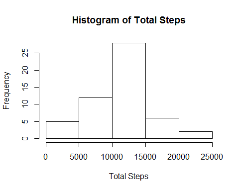
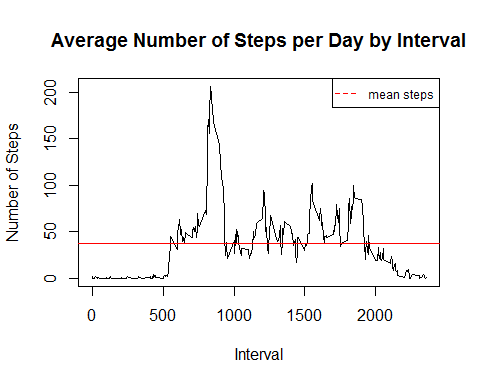
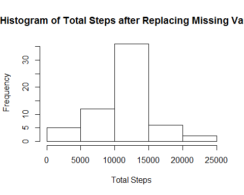
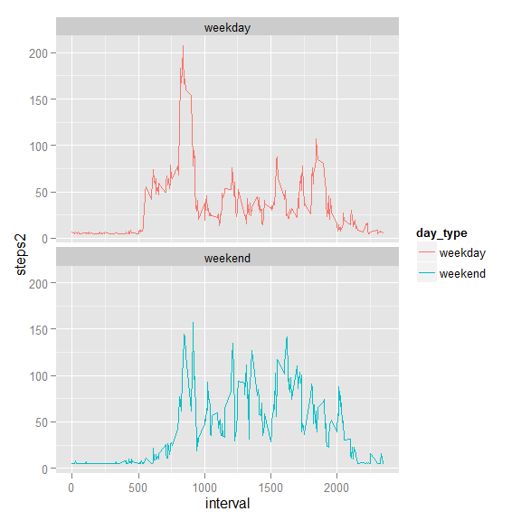

# Reproducible Research Project 1
Adraine Upshaw  
February 7,2016  

Loading and preprocessing the data
-------------------------------------

```r
options(scipen = 2, digits = 0)
setwd("~/DataScience/Reproducible Research")
#download.file("https://d396qusza40orc.cloudfront.net/repdata%2Fdata%2Factivity.zip", "~/DataScience/Reproducible Research/activity.zip")
data <- read.csv(unzip("activity.zip"))
head(data)
```

```
##   steps       date interval
## 1    NA 2012-10-01        0
## 2    NA 2012-10-01        5
## 3    NA 2012-10-01       10
## 4    NA 2012-10-01       15
## 5    NA 2012-10-01       20
## 6    NA 2012-10-01       25
```

```r
summary(data)
```

```
##      steps              date          interval   
##  Min.   :  0    2012-10-01:  288   Min.   :   0  
##  1st Qu.:  0    2012-10-02:  288   1st Qu.: 589  
##  Median :  0    2012-10-03:  288   Median :1178  
##  Mean   : 37    2012-10-04:  288   Mean   :1178  
##  3rd Qu.: 12    2012-10-05:  288   3rd Qu.:1766  
##  Max.   :806    2012-10-06:  288   Max.   :2355  
##  NA's   :2304   (Other)   :15840
```

```r
str(data)
```

```
## 'data.frame':	17568 obs. of  3 variables:
##  $ steps   : int  NA NA NA NA NA NA NA NA NA NA ...
##  $ date    : Factor w/ 61 levels "2012-10-01","2012-10-02",..: 1 1 1 1 1 1 1 1 1 1 ...
##  $ interval: int  0 5 10 15 20 25 30 35 40 45 ...
```

```r
data$date2 <- as.Date(data$date,format="%Y-%m-%d")
class(data$date2)
```

```
## [1] "Date"
```

What is mean total number of steps taken per day?
-------------------------------------
1. Calculate the total number of steps taken per day

```r
library(plyr);library(dplyr);library(knitr)

data_steps <- data[,c("date2","steps")]
group_steps <- group_by(data_steps,date2)
total_steps <- summarise_each(group_steps,funs(n(),sum))
head(total_steps)
```

```
## Source: local data frame [6 x 3]
## 
##        date2   n   sum
## 1 2012-10-01 288    NA
## 2 2012-10-02 288   126
## 3 2012-10-03 288 11352
## 4 2012-10-04 288 12116
## 5 2012-10-05 288 13294
## 6 2012-10-06 288 15420
```

2. Make a histogram of the total number of steps taken each day

```r
myhist <-hist(total_steps$sum,xlab="Total Steps",main="Histogram of Total Steps")
```


3. Calculate and report the mean and median of the total number of steps taken per day

```r
library(knitr);options(digits=2)
total_mean <- round(mean(total_steps$sum,na.rm =TRUE ),digits = 2)
total_med <- median(total_steps$sum,na.rm =TRUE )
```
The mean of the total number of steps taken per day is 10766.19.
The median of the total number of steps taken per day is 10765.

What is the average daily activity pattern?
-------------------------------------
1. Make a time series plot (i.e. type = "l") of the 5-minute interval (x-axis) and the average number of steps taken, averaged across all days (y-axis)

```r
total_interval <- aggregate(steps ~ interval, data, mean)
mymean <- mean(total_interval$steps)
plot(total_interval$interval,total_interval$steps, type="l", xlab="Interval", ylab="Number of Steps",main="Average Number of Steps per Day by Interval")
abline(h=mymean,col = "red", lwd = 1)
leg.txt <- c("mean steps")
legend("topright",      # Set location of the legend
       cex=0.75,     #everything is small
       legend = leg.txt,               # Specify text 
       col = c("red"),     # Set colors for legend
       lty = c(2),                   # Set type of lines in legend
       merge = TRUE)
```



2. Which 5-minute interval, on average across all the days in the dataset, contains the maximum number of steps?

```r
max_interval <- arrange(total_interval,desc(steps))
max <- max_interval[1,]
```
The 5-minute interval containing the maximum number of steps is 835 with 206.17 average steps.


Imputing missing values
-------------------------------------
1. Calculate and report the total number of missing values in the dataset

```r
missing <- sum(!complete.cases(data))
missing
```

```
## [1] 2304
```

2. Devise a strategy for filling in all of the missing values in the dataset. 

```r
library(zoo)
data$steps2 <- na.aggregate(data$steps)
missing_check <- sum(is.na(data$steps2))
missing_check
```

```
## [1] 0
```

3. Create a new dataset that is equal to the original dataset but with the missing data filled in.

```r
data2 <- select(data,date2,interval,steps2)
```

4.1. Make a histogram of the total number of steps taken each day and Calculate and report the mean and median total number of steps taken per day. 

```r
total <- aggregate(steps2 ~ date2, data2, sum)
myhist2 <-hist(total$steps2,xlab="Total Steps",main="Histogram of Total Steps after Replacing Missing Values")
```



4.2. Do these values differ from the estimates from the first part of the assignment? 

```r
total_mean2 <- round(mean(total$steps2,na.rm =TRUE ),digits = 2)
total_med2 <- median(total$steps2,na.rm =TRUE )
```
The mean of the total number of steps taken per day after imputing is 10766.
The median of the total number of steps taken per day after imputing is 10766.

4.3. What is the impact of imputing missing data on the estimates of the total daily number of steps?
By imputing the average, the distrubution is now not skewed (mean=median)

Are there differences in activity patterns between weekdays and weekends?
-------------------------------------
1. Create a new factor variable in the dataset with two levels - "weekday" and "weekend" indicating whether a given date is a weekday or weekend day.

```r
data3 <- mutate(data2,day_type=ifelse(weekdays(data2$date2) == "Saturday" | weekdays(data2$date2) == "Sunday", "weekend", "weekday"))
table(data3$day_type)
```

```
## 
## weekday weekend 
##   12960    4608
```

2. Make a panel plot containing a time series plot (i.e. type = "l") of the 5-minute interval (x-axis) and the average number of steps taken, averaged across all weekday days or weekend days (y-axis). 

```r
library(ggplot2)
plot_data <- aggregate(steps2~interval+day_type, data =data3, mean)

ggplot(plot_data, aes(x=interval, y=steps2, color = day_type)) +
  geom_line() +
  facet_wrap(~day_type, ncol = 1, nrow=2)
```


